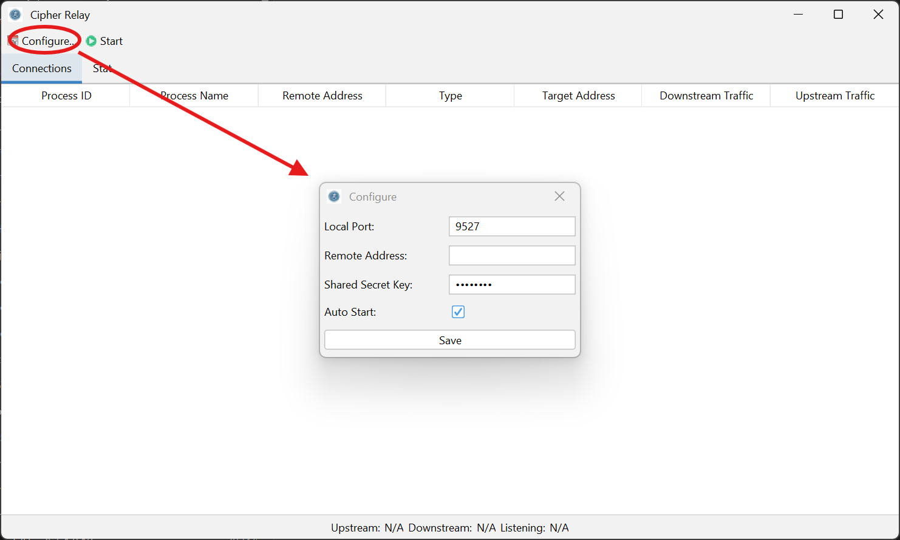
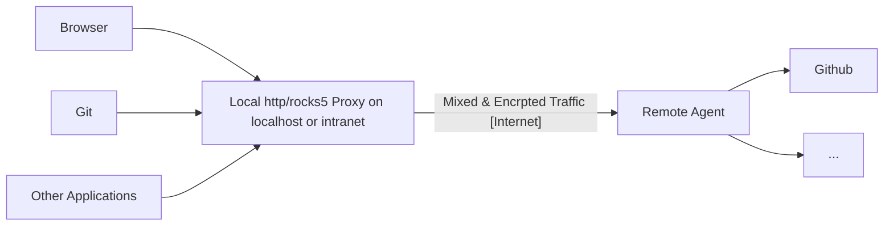

# Cipher Relay

Cipher Relay is an http/socks5 proxy encrypt your network traffic via a relayed remote and local proxy chain.


Cipher Relay is not a professional tool, it is just a fun project to explore a new approach to network privacy protection:
- [x] Encrypt traffic via a relayed remote and local proxy chain.
- [x] Support http/socks5 proxy protocol.
- [x] NO TLS and certificates are required.


# How to use it?

## 1. Run the remote agent.

```bash
# run the remote agent on your server
TODO
```

## 2. Run the local proxy.

### 2.1 Run the local proxy with command line.

```bash
# run the local proxy on your desktop
TODO
```

### 2.2 Run the local proxy with GUI.



# Mechanism

